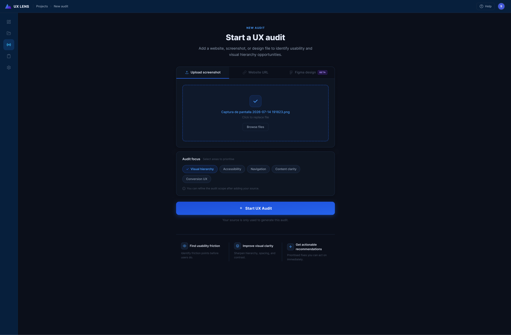
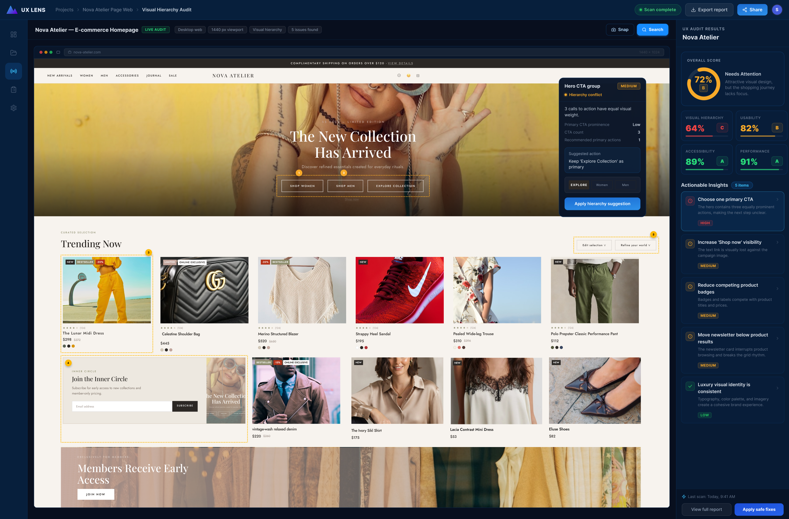
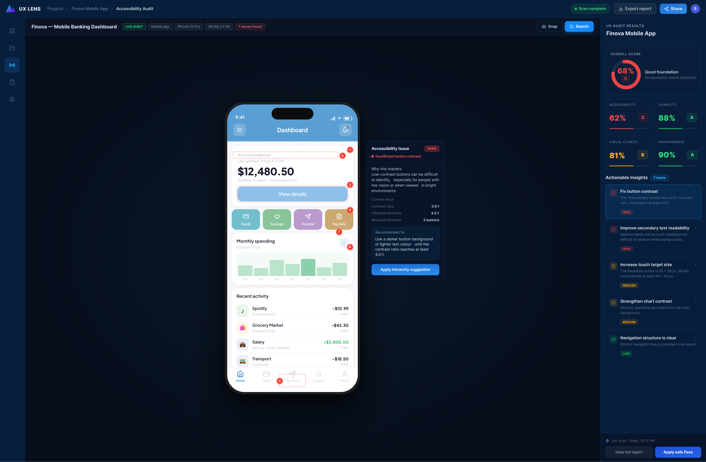
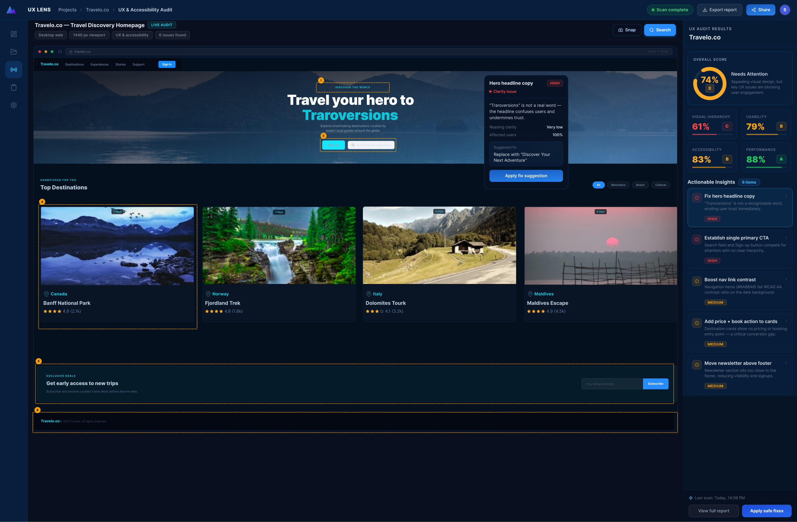

# UX Lens AI

## Tu idea en pocas palabras

**UX Lens AI** es una herramienta asistida por inteligencia artificial que revisa capturas de pantalla de sitios web y aplicaciones móviles para detectar posibles problemas de accesibilidad, claridad visual y experiencia de usuario.

La herramienta identifica elementos como contraste insuficiente, texto pequeño, jerarquía visual débil, llamadas a la acción poco claras, componentes inconsistentes y posibles puntos de fricción en una interfaz. UX Lens AI está diseñado para apoyar el trabajo de diseñadores y equipos de producto, no para reemplazar su criterio profesional.

## Antecedentes

Una interfaz puede verse atractiva y, aun así, ser difícil de usar. Problemas como botones poco visibles, textos con bajo contraste, demasiadas acciones compitiendo entre sí o información importante mal organizada son frecuentes en productos digitales.

Estos problemas pueden afectar a cualquier persona, pero tienen un impacto mayor en usuarios con discapacidad visual, personas mayores, personas que usan pantallas pequeñas o usuarios que navegan en condiciones de baja iluminación.

La motivación detrás de UX Lens AI es hacer que las revisiones de UX y accesibilidad sean más rápidas y accesibles. Muchas veces, los equipos no tienen tiempo o recursos para realizar una auditoría exhaustiva en cada etapa de diseño. Esta herramienta busca ofrecer una primera revisión visual con observaciones accionables para ayudar a detectar problemas antes de que lleguen a usuarios reales.

Este tema es importante porque una buena experiencia de usuario no consiste únicamente en que una página se vea bien: también debe ser clara, inclusiva, comprensible y fácil de utilizar.

## Datos y técnicas de IA

UX Lens AI trabaja principalmente con imágenes de interfaces, como capturas de pantalla de páginas web, aplicaciones móviles o diseños digitales.

Los datos de entrada pueden incluir:

- Capturas de pantalla de sitios web.
- Capturas de aplicaciones móviles.
- Diseños exportados desde herramientas como Figma.
- Información adicional sobre el tipo de auditoría que se desea realizar.

La herramienta puede enfocarse en diferentes aspectos de una interfaz:

- Jerarquía visual.
- Accesibilidad.
- Navegación.
- Claridad del contenido.
- Experiencia de conversión.

Para analizar las imágenes, UX Lens AI puede utilizar técnicas de inteligencia artificial y visión por computador, tales como:

- **Modelos multimodales:** para interpretar elementos visuales y textuales presentes en una interfaz.
- **Reconocimiento óptico de caracteres (OCR):** para detectar textos, tamaños de letra, etiquetas y llamados a la acción.
- **Análisis de contraste:** para identificar combinaciones de colores que podrían dificultar la lectura.
- **Detección de componentes visuales:** para reconocer botones, tarjetas, barras de navegación, formularios y otros elementos de interfaz.
- **Modelos de lenguaje:** para transformar los hallazgos técnicos en recomendaciones claras y priorizadas para diseñadores.

La calidad del análisis depende de la calidad de la captura de pantalla. Una imagen borrosa, incompleta o con baja resolución puede limitar la detección de textos, colores y componentes.

## ¿Cómo se utiliza?

UX Lens AI está pensado para diseñadores UX/UI, desarrolladores frontend, equipos de producto, agencias digitales y estudiantes que desean revisar una interfaz antes de publicarla o durante su proceso de mejora.

El flujo de uso es el siguiente:

1. El usuario carga una captura de pantalla, una URL o un diseño.
2. Selecciona el enfoque de la auditoría, por ejemplo: accesibilidad, jerarquía visual, navegación o conversión.
3. UX Lens AI analiza la interfaz y destaca áreas que podrían generar problemas.
4. La herramienta muestra una puntuación general y recomendaciones priorizadas según su impacto.
5. El diseñador revisa las sugerencias y decide cuáles aplicar según el contexto del producto y las necesidades de sus usuarios.

Las personas afectadas por esta solución incluyen:

- **Diseñadores y desarrolladores**, que pueden detectar problemas con mayor rapidez.
- **Equipos de producto**, que pueden priorizar mejoras de usabilidad.
- **Usuarios finales**, que se benefician de interfaces más claras y fáciles de utilizar.
- **Personas con necesidades de accesibilidad**, que pueden encontrar menos barreras al navegar por productos digitales.

## Ejemplos de auditoría

### 1. Auditoría de e-commerce

En este ejemplo, UX Lens AI analiza la página principal de una tienda de moda llamada **Nova Atelier**.

La auditoría identifica que varias llamadas a la acción del hero principal compiten por la misma atención visual. Botones como “Shop Women”, “Shop Men” y “Explore Collection” tienen una jerarquía similar, lo cual puede dificultar que el usuario sepa cuál es la acción principal.

**Hallazgos principales:**

- Falta de una llamada a la acción principal claramente priorizada.
- Baja visibilidad del enlace “Shop now”.
- Etiquetas y badges de productos que compiten con los nombres y precios.
- Elementos secundarios que pueden interrumpir el flujo de navegación.

**Posible recomendación:**

Definir una acción principal en la sección hero y reducir el peso visual de las acciones secundarias para guiar mejor la decisión del usuario.

### 2. Auditoría de una aplicación financiera

Este ejemplo muestra la auditoría de **Finova**, una aplicación móvil de banca y finanzas personales.

En una aplicación financiera, la claridad y la accesibilidad son especialmente importantes porque el usuario necesita interpretar información sensible, como saldos, transacciones y acciones de pago.

**Hallazgos principales:**

- Contraste insuficiente en el botón “View details”.
- Texto secundario con baja legibilidad sobre fondos claros.
- Objetivos táctiles pequeños en algunas acciones importantes.
- Contraste mejorable en gráficos de gastos mensuales.

**Posible recomendación:**

Aumentar el contraste entre el texto y los fondos, especialmente en botones y contenido financiero importante. También se recomienda ampliar las áreas táctiles para facilitar el uso desde dispositivos móviles.

### 3. Auditoría de una página de viajes

Este ejemplo analiza una página de descubrimiento de viajes llamada **Travelo.co**.

La página utiliza imágenes atractivas y una estética visual fuerte, pero UX Lens AI detecta algunos elementos que pueden afectar la comprensión y la conversión.

**Hallazgos principales:**

- El texto principal contiene una palabra poco clara: “Traroversions”.
- No existe una llamada a la acción principal claramente definida.
- Algunos elementos de navegación tienen contraste insuficiente.
- Las tarjetas de destinos y el formulario de suscripción podrían organizarse con una jerarquía más clara.

**Posible recomendación:**

Reemplazar textos ambiguos por mensajes claros y orientados a la acción, establecer un CTA principal y mejorar el contraste de la navegación para facilitar la lectura.

## Desafíos

UX Lens AI no resuelve todos los problemas de diseño o accesibilidad. Sus resultados deben interpretarse como recomendaciones iniciales y no como una auditoría definitiva.

Algunas limitaciones del proyecto son:

- La herramienta no puede comprender por completo el contexto de negocio, los objetivos de una marca o las necesidades específicas de cada usuario.
- Una captura de pantalla no permite evaluar todas las interacciones, animaciones, estados de error o comportamientos dinámicos de una aplicación.
- El análisis de contraste visual no sustituye una evaluación completa de accesibilidad realizada con usuarios reales y herramientas especializadas.
- Las recomendaciones generadas por IA pueden requerir revisión humana para evitar conclusiones incorrectas o poco relevantes.
- La herramienta no reemplaza pruebas de usabilidad, investigación con usuarios ni el criterio de diseñadores profesionales.
- La calidad de los resultados depende de la resolución, el contenido y la visibilidad de los elementos dentro de la imagen analizada.

## ¿Qué sigue?

UX Lens AI podría crecer en el futuro con nuevas funciones como:

- Análisis directo de páginas web mediante URL.
- Integración con Figma para revisar diseños antes de su desarrollo.
- Comparación entre diferentes versiones de una misma interfaz.
- Generación de informes exportables para equipos de diseño y producto.
- Recomendaciones basadas en las pautas WCAG.
- Evaluación de interfaces en diferentes tamaños de pantalla.
- Detección de problemas en flujos completos, no solo en una captura de pantalla.
- Priorización de problemas según impacto, esfuerzo de implementación y riesgo de accesibilidad.
- Pruebas asistidas con distintos perfiles de usuarios y necesidades de accesibilidad.

El objetivo a largo plazo es convertir UX Lens AI en un asistente de diseño que ayude a los equipos a crear productos digitales más inclusivos, claros y fáciles de usar.

## Agradecimientos

Este proyecto se inspira en el trabajo de la comunidad de diseño UX/UI, accesibilidad web y diseño inclusivo.

Agradecemos especialmente a:

- Las **Web Content Accessibility Guidelines (WCAG)** del W3C, que sirven como referencia para comprender buenas prácticas de accesibilidad digital.
- Diseñadores, desarrolladores y especialistas en accesibilidad que promueven productos digitales más inclusivos.
- Las herramientas y comunidades de diseño como Figma, que facilitan la creación y revisión de interfaces.
- Los recursos de código abierto, documentación técnica y ejemplos educativos utilizados durante la investigación y desarrollo del proyecto.

UX Lens AI fue creado con el propósito de apoyar el criterio humano y fomentar mejores prácticas de accesibilidad y experiencia de usuario.
