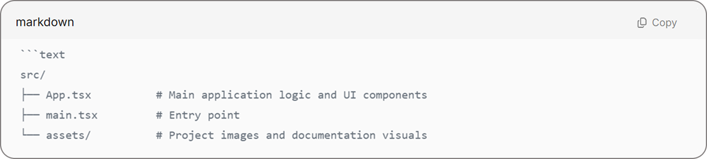
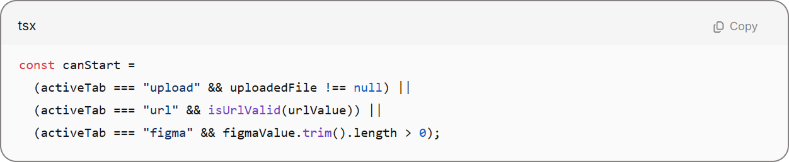
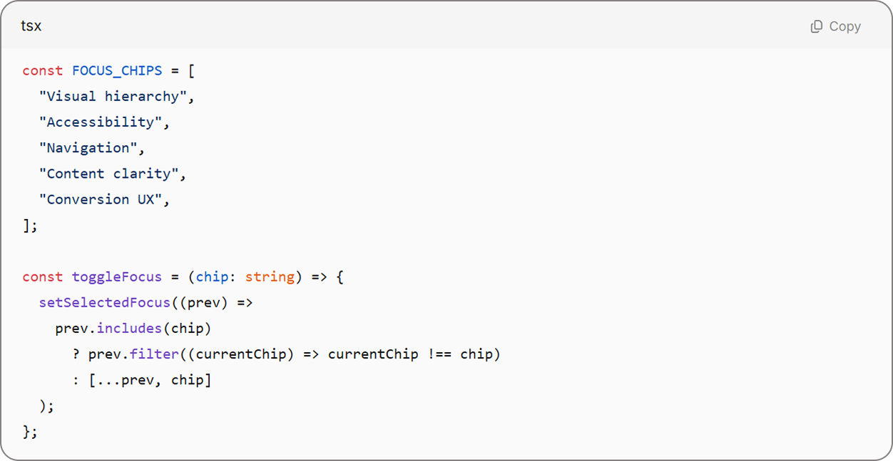

# UX Lens AI

## Summary
UX Lens AI is a specialized tool designed to perform rapid, AI-driven user experience audits. It analyzes screenshots to identify usability friction points and accessibility issues, providing designers with automated, actionable recommendations based on proven design heuristics.

### In a nutshell
The project aims to democratize UX expertise by providing an intelligent "second pair of eyes" that evaluates interfaces based on proven design principles and heuristic evaluation methods.

---

### Audit Examples

To demonstrate the capabilities of UX Lens AI, here are three actual audit results generated by the prototype:

#### 1. E-commerce Product Page
Analyzes the purchase flow, button visibility, and information density.
- **Key Insight:** The "Add to Cart" button lacked sufficient contrast against the background.
- **Recommendation:** Increase button saturation and add a subtle drop shadow to improve affordance.

#### 2. Finance Dashboard
Evaluates data visualization clarity and navigation for complex interfaces.
- **Key Insight:** Primary navigation items were too small for touch targets.
- **Recommendation:** Increase navigation item height to 48px and improve spacing between icons.

#### 3. Travel Booking Landing Page
Checks for visual hierarchy and conversion-focused design.
- **Key Insight:** The hero section had competing calls to action.
- **Recommendation:** Use a primary button for the main booking flow and a ghost button for secondary actions.

---

### Tech Stack
- **Frontend:** React with TypeScript.
- **Styling:** CSS-in-JS (Standard inline styling for prototype speed).
- **Icons:** Custom SVG components.
- **Version Control:** GitHub.

### Project Structure
The source code is organized to maintain a clear separation between components and logic. You can explore the full implementation in the `src/` directory.

### Core Interface Logic
The following example shows how the application validates the selected source before enabling the Start UX Audit button:

The user can also choose the areas that should be prioritized during the audit:

---

### Challenges
- **Visual Hierarchy Mapping:** Developing an algorithm that accurately identifies the most important elements on a screen.
- **Heuristic Automation:** Translating traditional UX heuristics into machine-readable rules for the AI backend.

### What's next?
- **Backend Integration:** Connect the React interface to an AI-powered backend that analyzes screenshots and generates audit findings.
- **History Tracking:** Implement a "History" section to track audit improvements over time.
- **Browser Extension:** Develop a Chrome extension for real-time live site audits.

### Acknowledgments
Thanks to the UX design community for providing the heuristic frameworks that power the logic of this tool.

### License
This project is licensed under the MIT License - see the [LICENSE](LICENSE) file for details.
